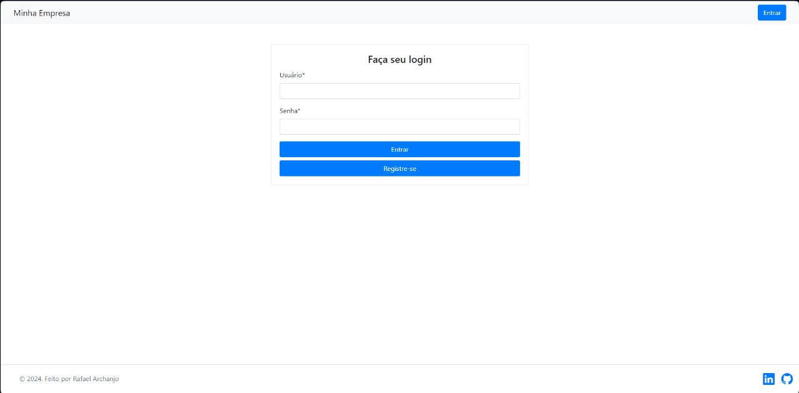
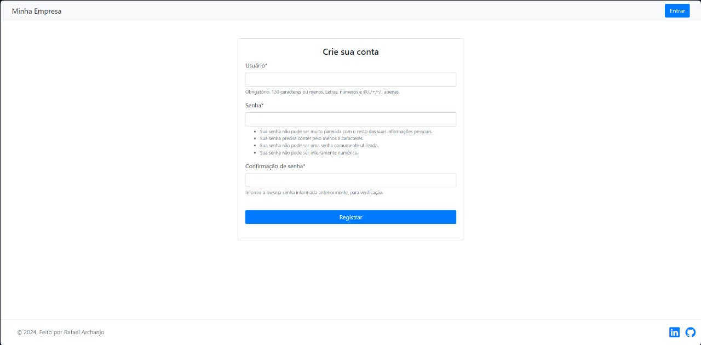
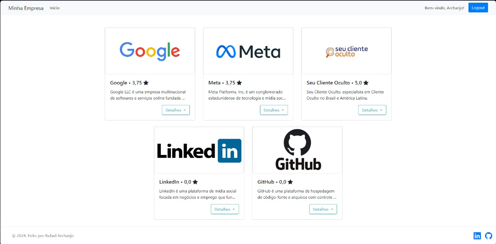
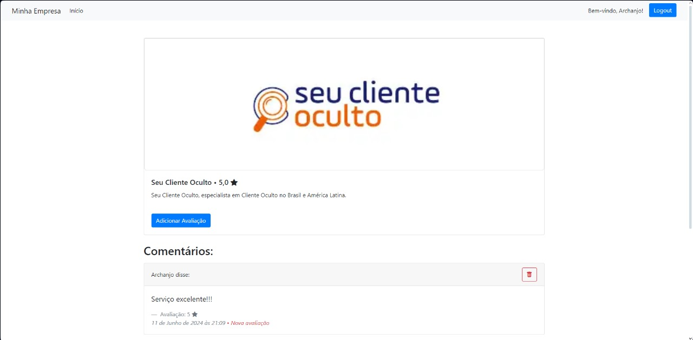

# Desafio Técnico do Processo Seletivo Seu Cliente Oculto 

## Índice
- [Desafio Técnico do Processo Seletivo Seu Cliente Oculto](#desafio-técnico-do-processo-seletivo-seu-cliente-oculto)
  - [Índice](#índice)
  - [Descrição do Desafio](#descrição-do-desafio)
    - [Telas Obrigatórias](#telas-obrigatórias)
  - [Telas Desenvolvidas](#telas-desenvolvidas)
    - [Base.html](#basehtml)
    - [Tela de LogIn (login.html)](#tela-de-login-loginhtml)
    - [Tela de Cadastro (cadastro.html)](#tela-de-cadastro-cadastrohtml)
    - [Tela Home (home.html)](#tela-home-homehtml)
    - [Tela de Detalhes (detalhes.html)](#tela-de-detalhes-detalheshtml)
  - [Diagrama de Entidade-Relacionamento](#diagrama-de-entidade-relacionamento)
  - [Contato](#contato)

## Descrição do Desafio
O desafio consiste no desenvolvimento de uma aplicação que permite aos usuários avaliar empresas já cadastradas. O único requisito obrigatório é o uso do Framework Django.

### Telas Obrigatórias
O projeto deve conter as seguintes telas:
- Tela de LogIn de usuários cadastrados;
- Tela com uma Listagem das empresas cadastradas para avaliação;
- Tela com os detalhes da empresa, exibindo suas avaliações e comentários.

## Telas Desenvolvidas

### Base.html
A tela base é composta pela barra de navegação e o rodapé das páginas. Ela serve como contêiner para as demais páginas e é responsável pela aplicação dos estilos em CSS3.

### Tela de LogIn (login.html)
Uma tela simples com campos de 'Nome de usuário' e 'Senha', além de botões como 'Entrar', que efetua o login caso os dados estejam corretos, e o botão 'Cadastre-se', que leva para a tela de cadastro onde é possível criar um usuário.

### Tela de Cadastro (cadastro.html)
Tela responsável pela criação de usuários para que possam acessar a aplicação por meio da tela de login. Esta tela conta com campos como 'Usuário', 'Senha' e 'Confirmação de Senha', além do botão 'Registrar' para salvar os dados inseridos caso estejam de acordo com a verificação padrão do Django.

### Tela Home (home.html)
Esta é a tela principal da aplicação, onde são mostrados cards que apresentam as empresas adicionadas para avaliação, contendo o nome da empresa, sua descrição, sua média de avaliação e o botão 'Detalhes' que leva para uma tela com uma visão mais detalhada da empresa.

### Tela de Detalhes (detalhes.html)
A tela de Detalhes oferece uma visão mais completa da empresa. Além do nome da empresa, descrição e média de avaliação, é possível ver as avaliações, quem as fez e a nota dada. Caso o usuário tenha feito uma avaliação, ele tem a opção de excluir a mesma. Há também um botão 'Adicionar Avaliação' que permite ao usuário avaliar a empresa.

## Diagrama de Entidade-Relacionamento
(Adicionar aqui o diagrama de entidade-relacionamento, caso tenha um.)

## Contato

---
